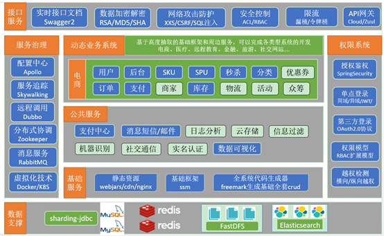

# gmall 商城实战项目
> 个人博客：https://wusuiwei.github.io/

本项目是基于SpringBoot+Mybatis+Duboo的微服务架构实战项目，包括gmall-web商城系统及gmall-admin-web商城后台
管理系统，基于SpringBoot2.X及相关技术栈开发。

前台商城系统包含首页门户、商品分类、新品上线、首页轮播、商品推荐、商品搜索、商品展示、购物车、订单结算、订单流程、个人订单管理、会员中心、帮助中心等模块。 

后台管理系统包含数据面板、轮播图管理、商品管理、订单管理、会员管理、分类管理、设置等模块。

该仓库仅包括后台功能及代码。
## 应用架构图

## 项目模块说明

| 模块或服务 | 功能 |
| -------- | ---------------------------------------------- |
首页	|   静态页面，包含了商品分类，搜索栏，商品广告位。
全文搜索|	通过搜索栏填入的关键字进行搜索，并列表展示
分类查询|	根据首页的商品类目进行查询
商品详情|	商品的详细信息展示
购物车	|   将有购买意向的商品临时存放的地方
单点登录|	用户统一登录的管理
结算	|   将购物车中勾选的商品初始化成要填写的订单
下单	|   填好的订单提交
支付服务|	下单后，用户点击支付，负责对接第三方支付系统。
订单服务|	负责确认订单是否付款成功，并对接仓储物流系统。
仓储物流|	独立的管理系统，负责商品的库存。（只对接接口不的单独讲解）
后台管理|	主要维护类目、商品、库存单元、广告位等信息。
## 项目使用的技术
使用技术（持续更新中...):
- maven - 构建项目
- swagger2 - 生成 api 文档
- Dubbo - RPC框架
- Mybatis - ORM框架
- Mybatis-Plus - Mybatis增强工具
- MySQL - 数据存储
- Redis - 数据存储

## 开发及部署文档
- 

