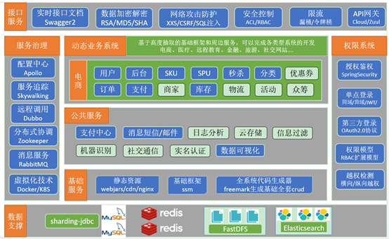
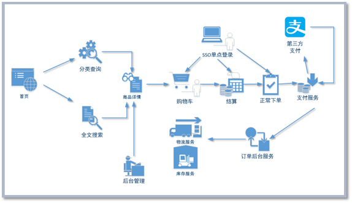

# Gmall 商城实战项目

    

# 前言

本项目是基于Spring Boot+Spring Cloud+Spring Data JPA的微服务架构实战项目，主要包括前台商城系统（web及小程序）、后台管理系统。

前台商城系统包含首页门户、商品分类、新品上线、首页轮播、商品推荐、商品搜索、商品展示、购物车、订单结算、订单流程、个人订单管理、会员中心、帮助中心等模块。 

后台管理系统包含数据面板、轮播图管理、商品管理、订单管理、会员管理、分类管理、设置等模块。

# 项目笔记

- 项目笔记地址：https://wusuiwei.github.io/tags/Gmall/
# 演示地址
- 商城Web端：
- 商城小程序端：
- 后台管理端：
# 架构分析
## 系统架构图

## 业务架构图

## 业务流程图

## 模块说明
| 模块或服务 | 功能 |
| -------- | ---------------------------------------------- |
首页	|   静态页面，包含了商品分类，搜索栏，商品广告位。
全文搜索|	通过搜索栏填入的关键字进行搜索，并列表展示
分类查询|	根据首页的商品类目进行查询
商品详情|	商品的详细信息展示
购物车	|   将有购买意向的商品临时存放的地方
单点登录|	用户统一登录的管理
结算	|   将购物车中勾选的商品初始化成要填写的订单
下单	|   填好的订单提交
支付服务|	下单后，用户点击支付，负责对接第三方支付系统。
订单服务|	负责确认订单是否付款成功，并对接仓储物流系统。
仓储物流|	独立的管理系统，负责商品的库存。（只对接接口不的单独讲解）
后台管理|	主要维护类目、商品、库存单元、广告位等信息。
# 技术栈
## 后端技术栈

## 前端技术栈

