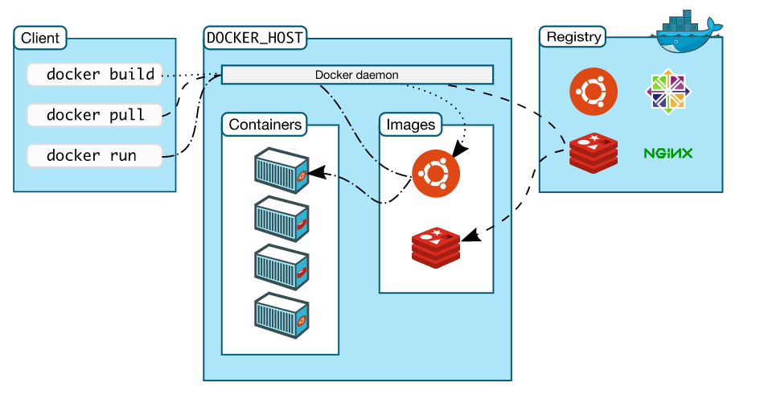

本项目中zookeeper(注册中心)、MySQL等均采用Docker安装，并且微服务采用docker方式启动。因此，学习Docker的基本功能及DockerFile的编写是十分有必要的。
### Docker 简介
Docker 是一个开源的应用容器引擎，让开发者可以打包他们的应用以及依赖包到一个可移植的容器中，然后发布到任何流行的Linux机器上，也可以实现虚拟化，容器是完全使用沙箱机制，相互之间不会有任何接口。
#### Docker 架构
Docker使用了C/S体系架构，Docker客户端与Docker守护进程通信，Docker守护进程负责构建，运行和分发Docker容器。
Docker客户端和守护进程可以在同一个系统上运行，也可以将Docker客户端连接到远程Docker守护进程。
Docker客户端和守护进程使用REST API通过UNIX套接字或网络接口进行通信。

**The Docker daemon(Dcoker守护进程)**

The Docker client
Docker registries
Docker objects
IMAGES
CONTAINERS
SERVICES

