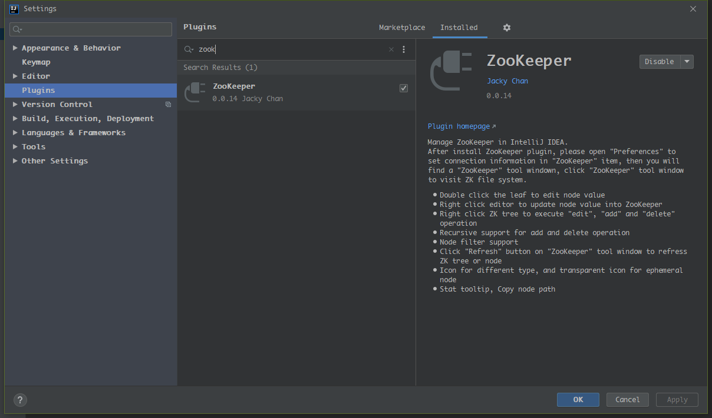
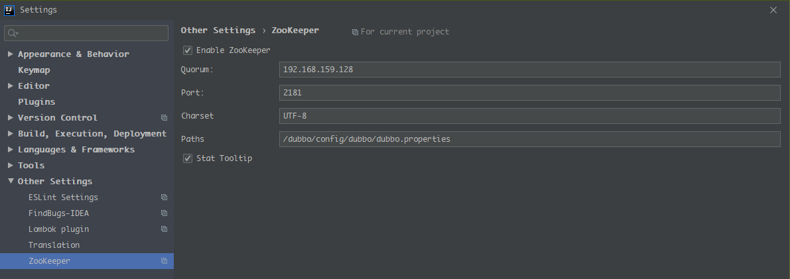
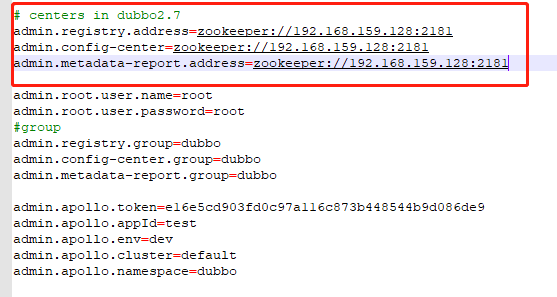
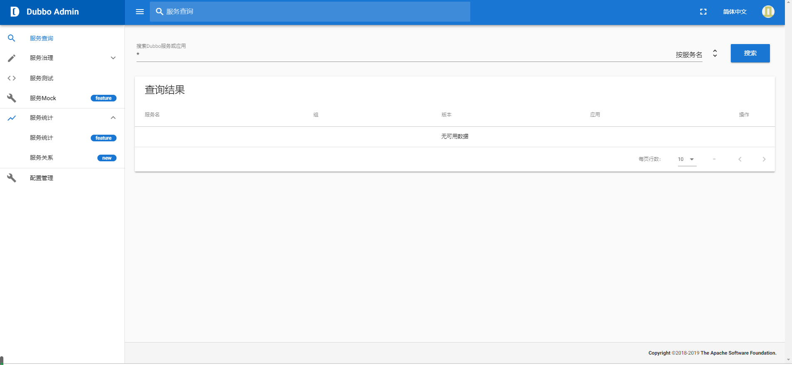

本项目使用Dubbo作为rpc框架，因此将使用dubbo控制台进行服务的监控与治理。而Dubbo推荐使用zookeeper作为注册中心，我们使用docker进行zookeeper的安装与配置。
- [Dubbo Admin](https://github.com/apache/dubbo-admin)
- [Docker](https://www.docker.com/)
- [Zookeeper](http://zookeeper.apache.org/)

Dubbo推荐使用zookeeper注册中心

#### Zookeeper安装

1. 下载zookeeper镜像

   > `docker pull zookeeper`

2. 运行zookeeper镜像

   > `docker run  -p 2181:2181 --privileged=true  --name zookeeper  -d  zookeeper`

3. 安装IDEA的Zookeeper插件

#### Dubbo控制台

github地址： https://github.com/apache/dubbo-admin 

##### 生产环境配置

1. 下载代码: `git clone https://github.com/apache/dubbo-admin.git` 

2. 在 `dubbo-admin-server/src/main/resources/application.properties`中指定注册中心地址

   > `application.properties`文件配置说明:  [配置说明](https://github.com/apache/dubbo-admin/wiki/Dubbo-Admin配置说明)

   

3. 构建

   > `mvn clean package`

4. 启动

   - `mvn --projects dubbo-admin-server spring-boot:run`
     或者
   - `cd dubbo-admin-distribution/target; java -jar dubbo-admin-0.1.jar`

5. 访问 `http://localhost:8080`

##### 开发环境配置

- 运行`dubbo admin server` `dubbo admin server`是一个标准的spring boot项目, 可以在任何java IDE中运行它
- 运行`dubbo admin ui` `dubbo admin ui`由npm管理和构建，在开发环境中，可以单独运行: `npm run dev`
- 页面访问 访问 `http://localhost:8081`, 由于前后端分开部署，前端支持热加载，任何页面的修改都可以实时反馈，不需要重启应用。
- 跨域问题 为了方便开发，我们提供了这种前后端分离的部署模式，主要的好处是支持前端热部署，在这种模式下，前端会通过8080端口访问后端的restful api接口，获取数据, 这将导致跨域访问的问题。因此我们在`dubbo-admin-ui/config/index.js`添加了支持跨域访问的配置,当前端通过`npm run dev`单独启动时，这些配置将被激活，允许跨域访问

